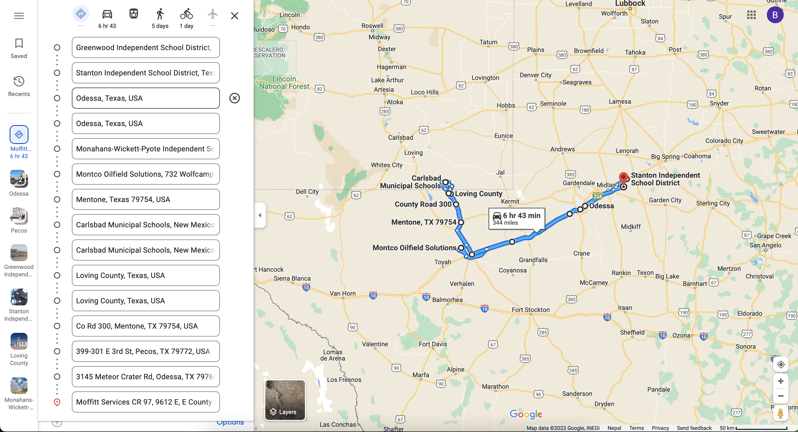

# Serverless Cloud Fucntion to render path in Google Map

This project is created in order to render users coordinates in the google map itself by creating a path. (Maximum data points it uses is 20).
It uses coordinates saved on the firestore and renders the path in the google map.

### PREREQUISITE
- install the `google-cloud-sdk` into the project from this link: https://cloud.google.com/sdk/docs/install

### STEPS:

- `yarn`
- Copy the firebase `PROJECT_ID` and paste it in the `.firebaserc` file
- `yarn gcloud init` select the project
- To deploy the function: `yarn firebase deploy`
- `yarn gcloud auth print-identity-token` and copy the auth token
- `curl -H "Authorization: Bearer [TOKEN] https://[FUNCTION_URL]/id=[SHIFT_ID]`

### TO RUN LOCALLY
- `yarn`
- Copy the firebase `PROJECT_ID` and paste it in the `.firebaserc` file
- `yarn gcloud init` select the project
- `yarn start`

